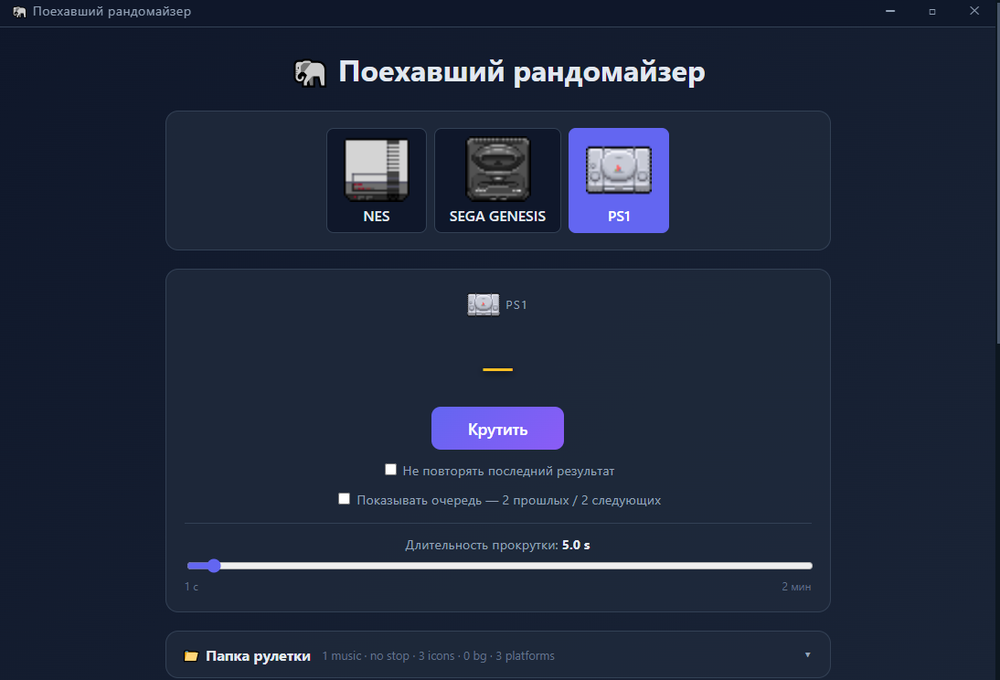

# 🐘 Поехавший рандомайзер



Настольное приложение (Electron) + веб-версия (Angular) для случайного выбора игр по платформам, добавляемых из текстовых файлов.

## Возможности

- **Рулетка** — случайный выбор игры с настраиваемой длительностью прокрутки (от 1 секунды до 2 минут, слайдер) и плавным замедлением перед остановкой
- **Динамические платформы** — список платформ и игр задаётся текстовыми файлами в папке `platforms/`; изменения подхватываются на лету, без перезапуска
- **Музыка и звуки** — во время прокрутки играет трек из папки `roulette/` (случайный, без повторов подряд), при остановке — звуковой эффект; громкость настраивается и запоминается
- **Иконки платформ** — изображения 72×72 из папки `roulette/` (RuletIco1, RuletIco2, … по порядку платформ)
- **Фон рулетки** — любой JPEG/PNG из папки `roulette/` (случайный при смене платформы)
- **Темы оформления** — Default (индиго) / Green / Purple, выбор запоминается
- **История прокруток** — последние 50 результатов, отдельно на каждую платформу
- **Импорт .txt** — загрузка списка игр из текстового файла прямо в редакторе

## Технологии

| Слой | Технологии |
| --- | --- |
| Frontend | Angular 17 (standalone, signals), TypeScript |
| Backend | Node.js, Express, fast-xml-parser |
| Desktop | Electron 30, electron-builder (NSIS + portable) |
| Отладка | VS Code launch.json (Node / Chrome / Edge / Electron) |

## Структура проекта

```text
randomizer-app/
├── electron/            # главный процесс Electron + preload
│   ├── main.js
│   └── preload.js
├── server/              # Express API
│   ├── server.js
│   ├── platforms.js     # динамический реестр платформ (txt)
│   ├── storage.js       # чтение/запись JSON/XML
│   └── roulette-scan.js # сканер медиа-папки
├── build/
│   └── icon.ico         # иконка приложения
├── src/
│   ├── main.ts          # загрузка Angular (+ ранняя установка темы)
│   ├── styles.css       # глобальные стили, палитры тем, скроллбар
│   └── app/
│       ├── app.component.*  # главный компонент (рулетка, аккордеоны, титлбар)
│       ├── models.ts
│       └── services/
│           ├── game-api.service.ts     # HTTP + SSE
│           ├── randomizer.service.ts   # логика рулетки + снимки состояния
│           └── audio.service.ts        # музыка/звуки/громкость
├── data/                # ← создаётся автоматически (хранилище)
├── platforms/           # ← создаётся автоматически (платформы и игры)
└── roulette/            # ← создаётся автоматически (медиа)
```

## Быстрый старт

Требуется **Node.js 18+**.

```bash
npm install
npm run dev        # API на :3000 + Angular на :4200 (прокси настроен)
```

Откройте http://localhost:4200

Прочие режимы:

```bash
npm run server          # только бэкенд (порт 3000)
npm start               # только фронтенд (нужен запущенный бэкенд)
npm run electron:start  # сборка + запуск десктоп-версии
```

### Сборка десктоп-приложения для Windows

```bash
npm run electron:win
```

Результат в папке `release/`:

- `Randomizer Setup <версия>.exe` — установщик (NSIS)
- `Randomizer <версия>.exe` — портативная версия (всё в одном файле)
- `win-unpacked/` — распакованная версия

### Расположение данных у собранного приложения

Папки `data\`, `roulette\`, `platforms\` создаются рядом с exe:

| Ситуация | Где данные |
| --- | --- |
| Портативный exe из `D:\Tools\` | `D:\Tools\` |
| Установка в доступную для записи папку | папка установки |
| Установка в `C:\Program Files` (нет прав) | `%APPDATA%\Randomizer\` (авто-fallback) |
| Режим разработки | корень репозитория |

Можно подготовить папки заранее (положить музыку, иконки, списки игр) — они подхватятся при первом запуске.

